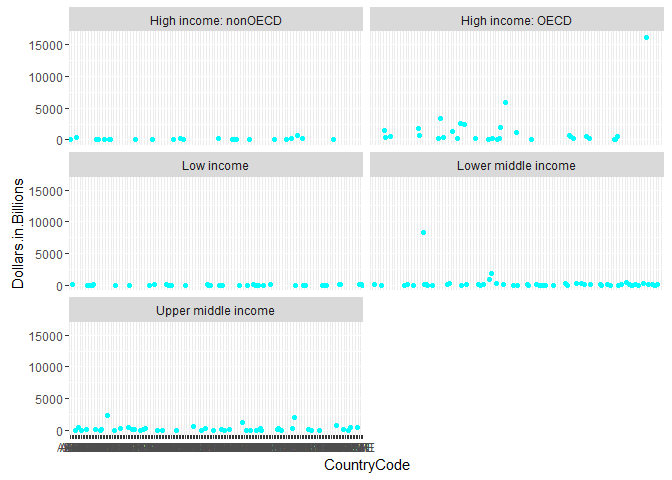

# GDP and Income Group Analysis
Johnny Quick  
June 12, 2016  
# **Analysis of GDP and Income Group of Countries**

##**Introduction** 

This is an analysis of GDP from 2014. We will also analyze education statistics from 1970-current. The data sets are provided by worldbank.org. We will download, tidy, and merge the data sets together. Then, we will obtain the average rankings for the "High Income: Organisation for Economic Co-operation and Development (OECD)" and also for the "High Income: nonOECD" groups. Additionally, we will plot the countries by GDP with colors according to their Income Group. Finally, we will separate the countries into 5 quantile groups by GDP; then, out of the top quantile, we will determine the number of countries whose income group is "Lower middle income".

###**Setting environment**

  * Load necessary packages and set directories


```r
## packages required: repmis, dplyr, and ggplot2
require(repmis)
```

```
## Loading required package: repmis
```

```r
require(plyr)
```

```
## Loading required package: plyr
```

```r
require(dplyr)
```

```
## Loading required package: dplyr
```

```
## 
## Attaching package: 'dplyr'
```

```
## The following objects are masked from 'package:plyr':
## 
##     arrange, count, desc, failwith, id, mutate, rename, summarise,
##     summarize
```

```
## The following objects are masked from 'package:stats':
## 
##     filter, lag
```

```
## The following objects are masked from 'package:base':
## 
##     intersect, setdiff, setequal, union
```

```r
require(ggplot2)
```

```
## Loading required package: ggplot2
```
#### **session info**

R version 3.3.0 (2016-05-03)
Platform: x86_64-w64-mingw32/x64 (64-bit)
Running under: Windows >= 8 x64 (build 9200)

locale:
[1] LC_COLLATE=English_United States.1252  LC_CTYPE=English_United States.1252   
[3] LC_MONETARY=English_United States.1252 LC_NUMERIC=C                          
[5] LC_TIME=English_United States.1252    

attached base packages:
[1] stats     graphics  grDevices utils     datasets  methods   base     

other attached packages:
[1] ggplot2_2.1.0 dplyr_0.4.3   plyr_1.8.4    repmis_0.5   

loaded via a namespace (and not attached):
 [1] Rcpp_0.12.4       digest_0.6.9      assertthat_0.1    R.methodsS3_1.7.1
 [5] grid_3.3.0        chron_2.3-47      R6_2.1.2          gtable_0.2.0     
 [9] DBI_0.4           magrittr_1.5      scales_0.4.0      httr_1.1.0       
[13] data.table_1.9.6  R.oo_1.20.0       R.utils_2.3.0     tools_3.3.0      
[17] R.cache_0.12.0    munsell_0.4.3     parallel_3.3.0    colorspace_1.2-6


```r
## Set directory variables
## main directory
maind <- "/Users/Johnny/OneDrive/Documents/6306/Unit6"

## data directory
datad <- paste(maind, "DATA", sep = "/")

## analysis directory
analysisd <- paste(maind, "ANALYSIS", sep = "/")

## set working directory to data directory
setwd(datad)
```

###**Loading data**

 1. Downloads GDP file from https://d396qusza40orc.cloudfront.net/getdata%2Fdata%2FGDP.csv 
    + Reads file into gdp
    + Checks variable names
    + Variable names don't look normal, so read file into gdp without header
    
 2. Downloads Educ file from  https://d396qusza40orc.cloudfront.net/getdata%2Fdata%2FEDSTATS_Country.csv
    + Reads file into educ
    + Checks variable names
    + Variable names look good


```r
## Set URL for download of GDP data
url <- "https://d396qusza40orc.cloudfront.net/getdata%2Fdata%2FGDP.csv"

## download the file from the url to gdp.csv file in working directory
download.file(url, destfile = "gdp.csv")

## read local csv file into gdp data frame
gdp <- read.csv("gdp.csv", stringsAsFactors = FALSE)

## check out variable names
names(gdp)
```

```
##  [1] "X"                           "Gross.domestic.product.2012"
##  [3] "X.1"                         "X.2"                        
##  [5] "X.3"                         "X.4"                        
##  [7] "X.5"                         "X.6"                        
##  [9] "X.7"                         "X.8"
```

```r
## variable names show that file doesn't have header row, 
##    so read in with header = FALSE for generic variable names
gdp <- read.csv("gdp.csv", stringsAsFactors = FALSE, header = FALSE)

## Set URL for download of education statistics data
url2 <- "https://d396qusza40orc.cloudfront.net/getdata%2Fdata%2FEDSTATS_Country.csv"

## download the file from the URL to educ.csv file in working directory
download.file(url2, destfile = "educ.csv")

## read local csv file into educ data frame
educ <- read.csv("educ.csv", stringsAsFactors = FALSE)

## check out variable names
names(educ)
```

```
##  [1] "CountryCode"                                      
##  [2] "Long.Name"                                        
##  [3] "Income.Group"                                     
##  [4] "Region"                                           
##  [5] "Lending.category"                                 
##  [6] "Other.groups"                                     
##  [7] "Currency.Unit"                                    
##  [8] "Latest.population.census"                         
##  [9] "Latest.household.survey"                          
## [10] "Special.Notes"                                    
## [11] "National.accounts.base.year"                      
## [12] "National.accounts.reference.year"                 
## [13] "System.of.National.Accounts"                      
## [14] "SNA.price.valuation"                              
## [15] "Alternative.conversion.factor"                    
## [16] "PPP.survey.year"                                  
## [17] "Balance.of.Payments.Manual.in.use"                
## [18] "External.debt.Reporting.status"                   
## [19] "System.of.trade"                                  
## [20] "Government.Accounting.concept"                    
## [21] "IMF.data.dissemination.standard"                  
## [22] "Source.of.most.recent.Income.and.expenditure.data"
## [23] "Vital.registration.complete"                      
## [24] "Latest.agricultural.census"                       
## [25] "Latest.industrial.data"                           
## [26] "Latest.trade.data"                                
## [27] "Latest.water.withdrawal.data"                     
## [28] "X2.alpha.code"                                    
## [29] "WB.2.code"                                        
## [30] "Table.Name"                                       
## [31] "Short.Name"
```

```r
## data has good variable names
```

###**Tidying data**

 1. educ data
    + Subsets educ into educ.tidy with only CountryCode and Income.Group variables
    + Views first and last 5 observations
    + Checks for NA values
 
 2. gdp data
    + Views first and last 10 observations
    + Checks dimensions
    + Checks number of NA values in entire data frame
    + Checks number of NA values in variables V3, V7, V8, and V9
        + all observations for variables V3, V7, V8, and V9 are NA values
    + Checks variable V6 to see if it contains valid data or all blank values
    + Creates gdp.tidy data with the following tidying
        + removes first 5 rows because they are headers and/or blanks
        + removes variables V3, V7, V8, and V9 as they contain all NA values
        + removes variable V6 as it contains only a few values of a,b,c,d,e,f which after looking at the data set online, it is for footnotes about the various countries
        + Removes observations where variable V1 is blank
        + Removes observations where variable V2 is blank
        + Verifies no NA values are remaining
        + Removes double quotes (") from any variable
        + Removes commas from variable V5
        + Converts variables V2 and V5 to integer
        + Divides variable V5 by 1000 for better visibiliy in plot
        + Sets variable names to "CountryCode", "Rank", "CountryName", "Dollars.in.Billions" respectively
        + Verifies variable names


```r
## only pick CountryCode and Income.Group from educ data
educ.tidy <- educ[,c("CountryCode", "Income.Group")]

## view first 5 observations of educ.tidy data frame to see if any data needs tidying further
head(educ.tidy, 5)
```

```
##   CountryCode         Income.Group
## 1         ABW High income: nonOECD
## 2         ADO High income: nonOECD
## 3         AFG           Low income
## 4         AGO  Lower middle income
## 5         ALB  Upper middle income
```

```r
## view last 5 observations of educ.tidy data frame to see if any data needs tidying further
tail(educ.tidy, 5)
```

```
##     CountryCode        Income.Group
## 230         YEM Lower middle income
## 231         ZAF Upper middle income
## 232         ZAR          Low income
## 233         ZMB          Low income
## 234         ZWE          Low income
```

```r
## educ.tidy data looks tidy, but let's do one final check
## verify number of NAs in educ.tidy data
sum(is.na(educ.tidy))
```

```
## [1] 0
```

```r
## view first 10 observations of gdp data frame to see if any data needs tidying
head(gdp, 10)
```

```
##     V1                          V2 V3            V4           V5 V6 V7 V8
## 1      Gross domestic product 2012 NA                               NA NA
## 2                                  NA                               NA NA
## 3                                  NA               (millions of    NA NA
## 4                          Ranking NA       Economy  US dollars)    NA NA
## 5                                  NA                               NA NA
## 6  USA                           1 NA United States  16,244,600     NA NA
## 7  CHN                           2 NA         China   8,227,103     NA NA
## 8  JPN                           3 NA         Japan   5,959,718     NA NA
## 9  DEU                           4 NA       Germany   3,428,131     NA NA
## 10 FRA                           5 NA        France   2,612,878     NA NA
##    V9 V10
## 1  NA  NA
## 2  NA  NA
## 3  NA  NA
## 4  NA  NA
## 5  NA  NA
## 6  NA  NA
## 7  NA  NA
## 8  NA  NA
## 9  NA  NA
## 10 NA  NA
```

```r
## view last 10 observations of gdp data frame to see if any data needs tidying
tail(gdp, 10)
```

```
##     V1 V2 V3 V4 V5 V6 V7 V8 V9 V10
## 322       NA          NA NA NA  NA
## 323       NA          NA NA NA  NA
## 324       NA          NA NA NA  NA
## 325       NA          NA NA NA  NA
## 326       NA          NA NA NA  NA
## 327       NA          NA NA NA  NA
## 328       NA          NA NA NA  NA
## 329       NA          NA NA NA  NA
## 330       NA          NA NA NA  NA
## 331       NA          NA NA NA  NA
```

```r
## get observation count in GDP data
dim(gdp)
```

```
## [1] 331  10
```

```r
## there are 331 observations in GDP data

## check number of NAs in GDP data
sum(is.na(gdp))
```

```
## [1] 1655
```

```r
## The number of NAs in GDP data before tidying is 1655

## check number of NAs in variables V3, V7, V8, and V9 in GDP data
##    as they look to contain all NA from the head and tail output
sum(is.na(gdp$V3))
```

```
## [1] 331
```

```r
sum(is.na(gdp$V7))
```

```
## [1] 331
```

```r
sum(is.na(gdp$V8))
```

```
## [1] 331
```

```r
sum(is.na(gdp$V9))
```

```
## [1] 331
```

```r
## each of the variables V3, V7, V8, and V9 have 331 NA values
##    which is the same as the total number of observations

## check variable V6 as it looks to have all blanks and not a valid variable
table(gdp$V6)
```

```
## 
##       a   b   c   d   e   f 
## 325   1   1   1   1   1   1
```

```r
## remove first 5 observations because they are headers and/or blanks
## remove variables V3, V7, V8, and V9 as they contain all NA
## remove variable V6 as it contains only a few values of a,b,c,d,e,f
##    which after looking at the data set online, it is for footnotes about
##    the various countries
## so create gdp.tidy data set including only observations 6-331 and variables 1, 2, 4, and 5
gdp.tidy <- gdp[c(6:nrow(gdp)),c(1,2,4,5)]

## remove observations where variable V1 = ""
blanklines <- which(gdp.tidy$V1 == "")
gdp.tidy <- gdp.tidy[(-1 * blanklines),]

## remove observations where variable V2 = ""
blanklines <- which(gdp.tidy$V2 == "")
gdp.tidy <- gdp.tidy[(-1 * blanklines),]

## verify no NA values are left
sum(is.na(gdp.tidy))
```

```
## [1] 0
```

```r
## remove double quotes from variable V5
gdp.tidy$V5 <- gsub("\"", "", gdp.tidy$V5)

## remove commas from variable V5
gdp.tidy$V5 <- gsub(",", "", gdp.tidy$V5)

## convert variable V5 to integer
gdp.tidy$V5 <- as.integer(gdp.tidy$V5)

## divide variable V5 by 1000 for better visibility in plot
gdp.tidy$V5 <- gdp.tidy$V5 / 1000

## conver variable V2 to integer
gdp.tidy$V2 <- as.integer(gdp.tidy$V2)

## Set variable names for gdp data
varnamegdp <- c("CountryCode", "Rank", "CountryName", "Dollars.in.Billions")
names(gdp.tidy) <- varnamegdp

## Verify new variable names
names(gdp.tidy)
```

```
## [1] "CountryCode"         "Rank"                "CountryName"        
## [4] "Dollars.in.Billions"
```

###**Merging data**

  * Merges gdp and educ tidy data frames by variable CountryCode
    + Verifies number of matches during the merge
    + Determines which country codes did not match if any
    + Sorts in descending order by variable rank
    + Checks first 5 observations of the first and second variable to verify sort worked as designed
    + Obtains the 13th observation's country
    + Views table of variable Income.Group to determine values
    + Calculates means of Income.Group = "High income: nonOECD"
    + Calculates means of Income.Group = "High income: OECD"


```r
## merge gdp and educ data frames by CountryCode
gdp.and.educ <- merge(gdp.tidy, educ.tidy, by="CountryCode")
```

**Question 1. After merging, how many of the country codes matched?**

According to the dimensions below, there are 189 observations; therefore, there are 189 matches on country code


```r
## check dimensions on merged table to determine number of matches
dim(gdp.and.educ)
```

```
## [1] 189   5
```

```r
## sort data frame by rank in descending order
gdp.and.educ <- gdp.and.educ[order(gdp.and.educ$Rank, decreasing = TRUE),]

## check first few observations to show country code and rank 
##    to verify sort descending worked
head(gdp.and.educ[c(1, 2)], 5)
```

```
##     CountryCode Rank
## 173         TUV  190
## 92          KIR  189
## 113         MHL  188
## 137         PLW  187
## 155         STP  186
```

**Question 2. After sorting, what is the 13th country**

The 13th country after sorting the GDP rank is St. Kitts and Nevis as shown below.


```r
gdp.and.educ$CountryName[13]
```

```
## [1] "St. Kitts and Nevis"
```

```r
## Check to see values of Income.Group variable
table(gdp.and.educ$Income.Group)
```

```
## 
## High income: nonOECD    High income: OECD           Low income 
##                   23                   30                   37 
##  Lower middle income  Upper middle income 
##                   54                   45
```

**Question 3. What are the average GDP rankings for the "High income: OECD" and the "High income: nonOECD" groups?**

The mean (avg) rank of High income: nonOECD group is 91.91304 as shown below.

The mean (avg) rank of High income: OECD group is 32.96667 as shown below.


```r
## Get mean (avg) rank of High income: nonOECD group 
mean(subset(gdp.and.educ, Income.Group == "High income: nonOECD")$Rank)
```

```
## [1] 91.91304
```

```r
## Get mean (avg) rank of High income: OECD group 
mean(subset(gdp.and.educ, Income.Group == "High income: OECD")$Rank)
```

```
## [1] 32.96667
```

###**Analyzing data**

 1. Plots Dollars.in.Billions by CountryCode (colored by Income Group), including interpretation of the plot

 2. Creates a table quantile versus income group and determines how many countries are Lower middle income but among the 38 nations with the highest GDP

**Question 4. Plot the GDP for all of the countries. Use ggplot2 to color your plot by income group**

The plots below show that all of the income groups with the exception of the High income: OECD group have very little variance. The lower middle income group has an outlier. The high income: OECD group has much more variance between the GDPs, and it contains an extreme outlier. The high income: OECD group also has much higher GDPs than the other income groups.


```r
## attach sorted data set to just provide variable names
attach(gdp.and.educ)

## qplot of Dollars.in.Billions by CountryCode, colored by and segregated by Income Group

ggplot(gdp.and.educ, aes(CountryCode,Dollars.in.Billions))+geom_point(color="cyan")+
    facet_wrap(~Income.Group, ncol=2)
```

<!-- -->

```r
## detach sorted data set
detach(gdp.and.educ)
```

**Question 5. Make a table quantile versus income group. How many countries are Lower middle income but among the 38 nations with the highest GDP?**

In reading the table below, we see that 5 countries are in the Lower middle income group, but among the 38 nations with the highest GDP (quantile 5)


```r
## separate the sorted data set into 5 quantiles
gdp.and.educ <- within(gdp.and.educ, quantile <- as.integer(cut(Dollars.in.Billions, quantile(Dollars.in.Billions, probs = 0:5/5), include.lowest = TRUE)))
## view header of sorted data set to see new quantile variable
head(gdp.and.educ)
```

```
##     CountryCode Rank           CountryName Dollars.in.Billions
## 173         TUV  190                Tuvalu               0.040
## 92          KIR  189              Kiribati               0.175
## 113         MHL  188      Marshall Islands               0.182
## 137         PLW  187                 Palau               0.228
## 155         STP  186 São Tomé and Principe               0.263
## 59          FSM  185 Micronesia, Fed. Sts.               0.326
##            Income.Group quantile
## 173 Lower middle income        1
## 92  Lower middle income        1
## 113 Lower middle income        1
## 137 Upper middle income        1
## 155 Lower middle income        1
## 59  Lower middle income        1
```

```r
## use table function to create a table quantile versus income group
table(gdp.and.educ$Income.Group, gdp.and.educ$quantile)
```

```
##                       
##                         1  2  3  4  5
##   High income: nonOECD  2  4  8  5  4
##   High income: OECD     0  1  1 10 18
##   Low income           11 16  9  1  0
##   Lower middle income  16  9 11 13  5
##   Upper middle income   9  8  8  9 11
```

##**Conclusion**

It is highly beneficial to belong to the OECD (Organisation for Economic Co-operation and Development) and be in the High income group. This illustrates the benefits of working together. 
